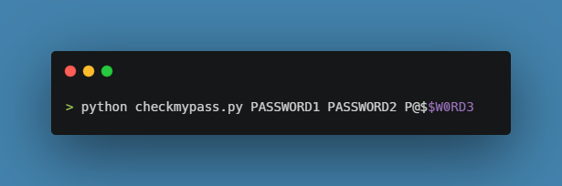
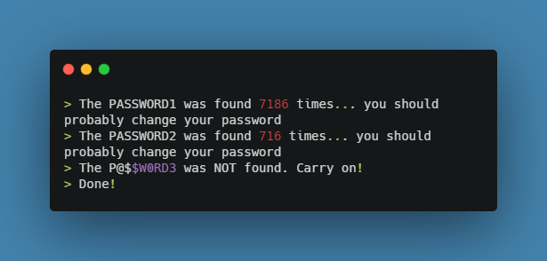
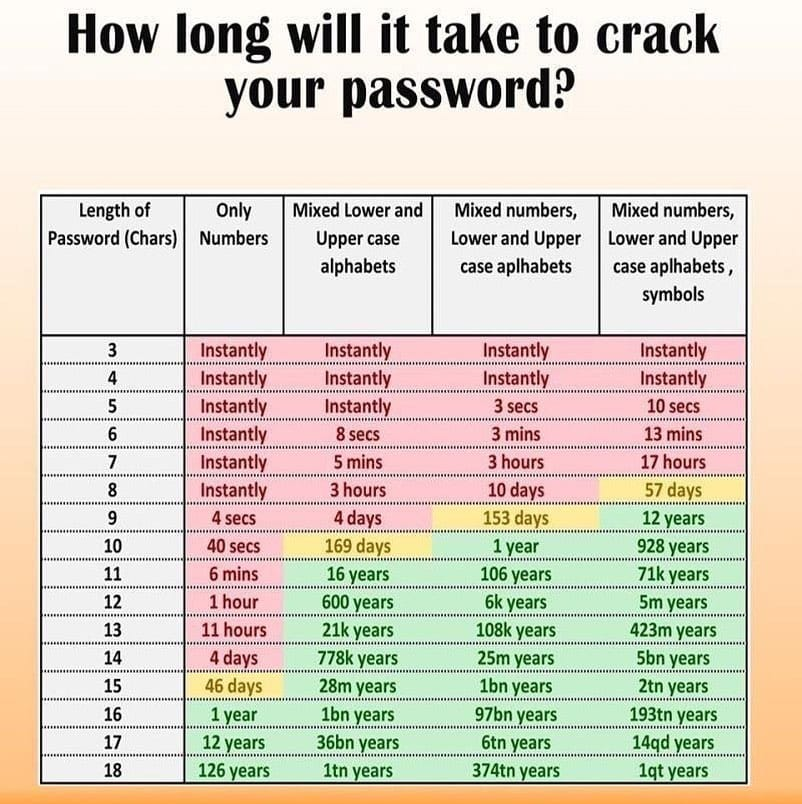

# Password-checker
<em>The most secure password checker project</em>
Password-checker is a python script which checks whether your password is ever being being hacked/leaked or not.

## Working of the code:
- Password-checker script gets input(s) from the command line and checks whether it's ever being hacked/leaked or not.

    

- The idea here is implemented using an API, request/response cycle, and hashing
- The script is implemented in three key functions:
1. pwned_api_check()
2. request_api_data()
3. get_password_leaks_counts()
---
- The script works by taking input as command line arguements: PASSWORD1, PASSWORD2, P@$$W0RD3 (for example)
- Later, the passwords gets hashed using SHA1 algorithm for secure request/response over the internet
- Then, the hashed password is divided into two parts namely, head and tail
---
- Now, only the *head of the hashed password* is sent as a request query through the API
- The API being used is offered by [Have I Been Pwned](https://haveibeenpwned.com/Passwords) website.
- The process of sending only the head is known as [**k-anonymity**](https://en.wikipedia.org/wiki/K-anonymity#:~:text=The%20concept%20of%20k%2Danonymity,subjects%20of%20the%20data%20cannot)
(This process is done for secure request/response cycle over the internet to avoid Man in the Middle attack)
---
- The response we receive is a list of tail part of password hashes, and the number of times the password is leaked from the API's database server
- Now, the tail part of our hash can be compared with the set of hashes and counts received from the API to securely check our password's strength
- And the result is provided either with the count of hacks or your password is secure message as follows:

    

---

### Importance of password strength
- Importance of the strength of your password is vital in the protection of your personal data.
- The strength of the password depends on factors like:
    - Length of your password
    - Usage of numbers
    - Usage of lowercase letters
    - Usage of uppercase letters
    - Usage of special characters
- If you take care of the above factors, the time taken to crack your password will be: 

    

---

## Contributors

- T Aswin Barath <https://github.com/AswinBarath>
- G Kishore <https://github.com/gkrockz>